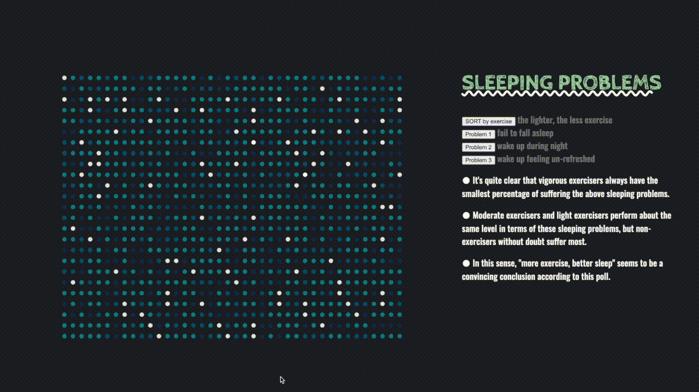

## Sleep VS. Exercise
Suffering sleep problems? Wanna know how exercise influence sleep? This is a data visualization project for you revealing the relationship between sleep and exercise based on National Sleep Foundation's [*Sleep in America Poll*](https://www.sleepfoundation.org/professionals/sleep-americar-polls/2013-exercise-and-sleep). You can either browse the website to see a general trend, or see yourself by inputting your personal condition including age, time to bed, sleep durations, exercising frequency, etc at the very first beginning.

### links
- link to the project [here](https://koapush.github.io/cdv-student/projects/data-story/)
- paper prototype [here](https://github.com/Koapush/cdv-student/blob/main/projects/data-story/paper-prototype.pdf)
- contextual [report](https://docs.google.com/document/d/1cDzqWPpsl3j5gNwE3g2FKcNkaeO5fTKNM9SC_A4lPik/edit) and [presentation slides](https://docs.google.com/presentation/d/1SB5UsZYPoDOT8SxcKB8L67YrwkyXeGYXvuoY3cEktJU/edit)

### demo  

### about data
- [questionnaire](https://www.sleepfoundation.org/wp-content/uploads/2018/10/SIAQuestionnaire2013.pdf)
- [raw data](https://els-jbs-prod-cdn.jbs.elsevierhealth.com/pb/assets/raw/Health%20Advance/journals/sleh/2013SleepinAmericaPollExerciseandSleepRawDataExcel.xls)  

Since the raw data excel is a collection of 1,000 respondents' answers to the above questionnaire, the data is all option numbers of questions. Most of the option numbers represent time spans/types of conditions rather than specific data to visualize, therefore in the js file I manually convert columns of option numbers into the corresponding amount of time/exercise/etc. In order to visualize data points diversely, I apply functions such as Math.random() and Math.floor() to those option numbers representing numerical intervals (the first four questions in the questionnaire might serve as a good example here).

### about process
- In general, I separate the project into three sections: sleep, exercise and sleeping problems. The "sleep" section visualizes the general trend of time to bed and sleep durations of all 1,000 respondents. Through further coloring the by age and changing radius of data points, it is easier to recognize how these factors influence each other and what groups of people tend to suffer bad sleep condition. Later the "exercise" section clusters the data points by exercise frequency, through which users can see how the above trends further among different exercising groups. Finally in the "sleeping problems" section, different exercising groups colored accordingly will be sorted and move together, therefore by clicking buttons, the lines will show up to highlight the proportion. In this sense, how each exercising group performs in terms of each sleeping problem is clearly visualized and easily compared to draw conclusions.
- Inspired by the [Sleep Calculator](https://www.sleepfoundation.org/sleep-calculator) project, I applied an interaction design to visualize users' personal condition throughout the whole project. Yet due to the time limit, I didn't develop it as I expected, partly because there is another part of visualization I proposed and tried yet didn't apply in the end due to the overlap with the existing graphs.
- As for the relationship between sleep and exercise, a general "more exercise better sleep" conclusion can be seen from the visualization; yet it is not as obvious as I expected. Questioned by one of the critic in the final presentation, I realized that it might because the relationship between sleep and exercise might be complicated itself, thus not leading to a rather straightforward positive correlation -- meaning there are far more details deserve exploring and researching on.
- Therefore if time allows, I'll definitely dig deeper into the dataset and try to find those hidden (and probably unexpected) relationship between sleep and exercise. Also, since the poll is conducted in 2013 and only targets Americans aged from 23 to 60, finding other related datasets to make comparisons or demonstrate changes throughout years also serves as a good way out to enrich this project. And as for the project design, I might apply different ways of visualization depending on the relationship I'm gonna demonstrate after the research work.
