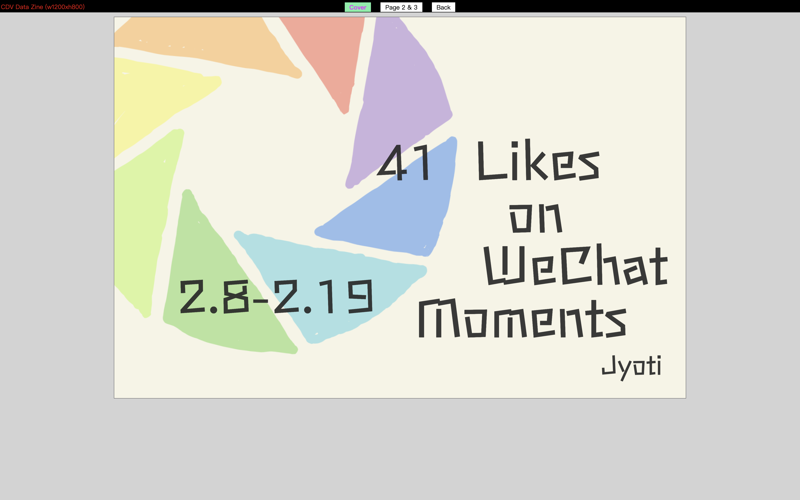
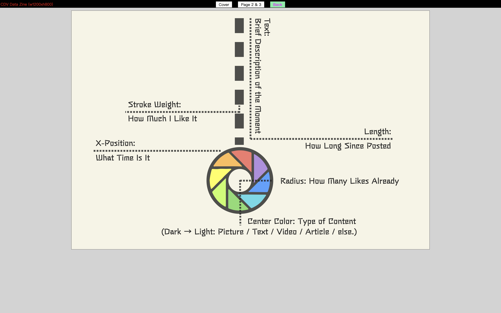

## Data Zine Project

### Screenshots and Links:
- Link to the [live website](https://koapush.github.io/cdv-student/projects/zine-project/cover.html)  
- Link to the [presentation](https://drive.google.com/file/d/1BCSxbmT-Gyg_ROcSA6JE-61TLaxrZm8S/view?usp=sharing)  
- Screenshots:

  

### Timeline
- Week 3: Collect Data, First coding draft
- Spring Festival: Collect Data (this will contrast great with data collect during school time), Coding
- Week 4: Collect Data, Resolve coding questions
- Week 5: Final Coding
- Week 6: Presentation (Due Monday, Mar8)  

### Refection:
>What data did you choose to collect?  
>How did you collect it, was was the routine?  
>Why did you choose to visualize the data in this way?  
>What can be seen in the visualization? Does it reveal something you didn't expect?  
>Did you make crucial compromises? Which ones?  
>If this project had a larger scaler and wasn't designed for print, how would you imagine it to be?  

As for my data zine project, I decided to collect my habits of marking likes on others’ WeChat moments. At the very first beginning, I was intended to collect the data of people’s different ways of wearing masks, which seems to be more a scientific research (with high requirement of processing all variables to make sense) than a daily observation of myself. Thanks to Gloria and Stefanie’s Dear Data project, I was greatly inspired and therefore decided to collect my marking habits, since I can more or less realize the fact that I tend not to mark likes on those already being marked by many other friends even if I very much like it. I believe it would be quite intriguing to have a close-up view on it.  

Speaking of the data, I collected all the moments that I marked as like from 2/8 to 2/19, 41 in total. I was considering to organize them on a weekly basis, but then found that it might not make much sense since whether I marked as like was more related to the content of the moment, rather than the exact date. Therefore I determined to present the data in a daily routine, 24 hours in other words, which even demonstrates my daily habit of browsing WeChat Moment in general. To be more specific on the visualization, I apply the WeChat Moment logo (many thanks to Leon:) but change the styles according to my own designing: the radius refers to the number of likes it was marked by other friends already; the length of the dotted lines (i.e, the y position) represents how long since it was posted (the y axis is marked on the left with clear scale); the relative width of the dotted lines and the logo reveals the exact degree I like the content of the moment; the center color represents the type of the content (picture, text, video, article from dark colors to light colors respectively); and as mentioned, all the data points are positioned along x axis according to the exact time I see and mark likes on that moment. I further put some brief descriptions of the content along the lines. And the dark background color represents the “dark mode” of my WeChat settings.  

To take a more look at the visualization, some of the interesting observations are as follows:
- Many of the data points are, at the first glance, not that big, which indicates my original awareness of marking moments with less likes already.
- Most of the y positions of the data points lie within the range of less than 100 minutes, meaning that I tend to mark likes on the moments that haven’t been posted for a long time (the longer, the bigger; the more time has already passed, the more likes it might possibly receive).
- The inner color tends to be darker, somehow indicating that I tend to mark likes on moments with nice pictures (not sure yet).
- 9AM, 3PM, 9PM, and specifically 1AM are some of the time periods with denser data points, implying that I browsed WeChat Moment frequently at those times (or maybe more friends tend to post moments hours before, so that I would mark likes on them).  
  - 9AM: browsing my phone on the shuttle bus (I take 8:45 shuttle every day)
  - 3PM: class ends - distraction time (understandable)
  - 9PM: distraction time? (Was not realizable before)
  - 1AM: the later I sleep, the more likes I mark - to notify my friends that I haven’t slept yet :/  

Generally speaking, I’m satisfied with the overall process and achievement of this data zine project. Some of the useful and impressive knowledge I learned about d3.js includes linear / time scale(), x / y axises, SVG shapes (one of the most challenging part for me), etc. I still remember the first time watching Leon’s tutorial videos to see the color of the histogram changing linearly within only one line of code using linear scale and strings of color directly. Same for the trick of transforming the logo image into svg format using Adobe Illustrator, and then applying the paths of svg into js using html() method.   

I think I’ve realized almost all my visualization ideas in this project. One pity would be that during the process of collecting data, I once marked as like on one moment for some time, yet due to the annoying notification of other friends keeping marking / commenting, I finally canceled my like on that moment. I found this observation would be quite interesting in terms of the general collection of data. However since I didn’t come up with an ideal way of presenting this, I didn’t put it into my collections at the end. If this project had a larger scaler and wasn’t designed for print, say, if it was presented in html format, I’ll definitely make it a dynamic web designing, which at least showing the descriptions as triggered instead of print them out. Also, each data points would be designed with more effects, and ideally, I’d like to think of various ways instead of one to visualize the data.
